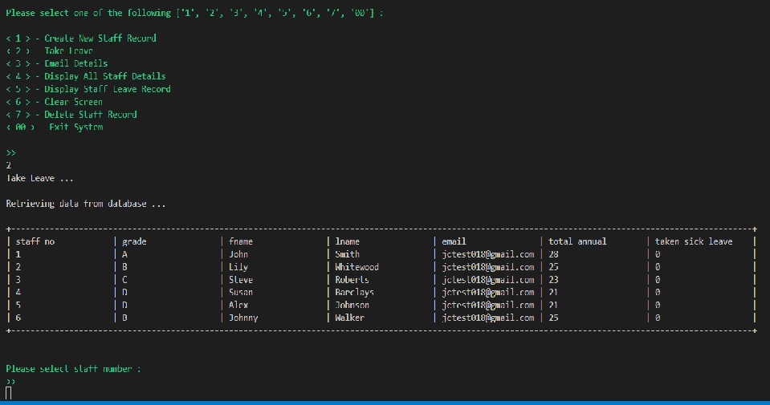
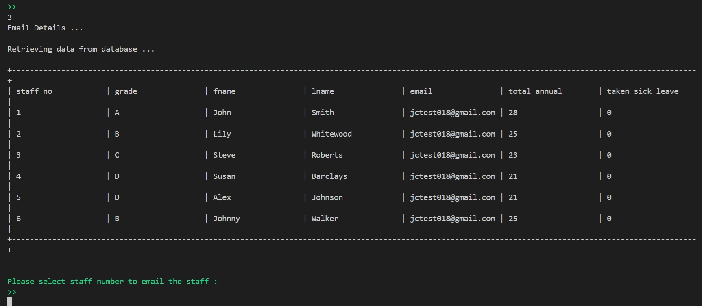
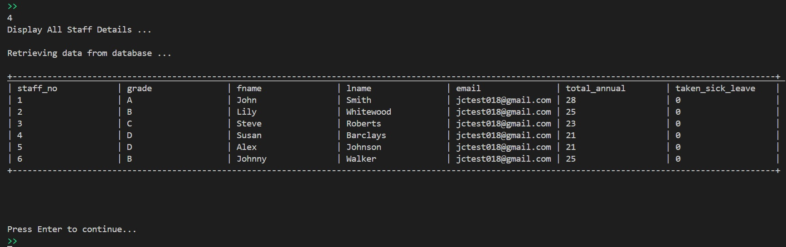
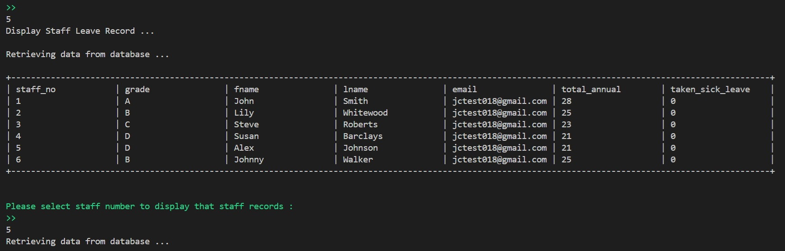
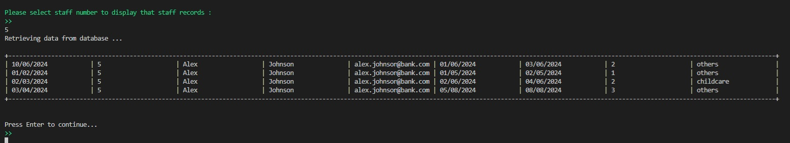
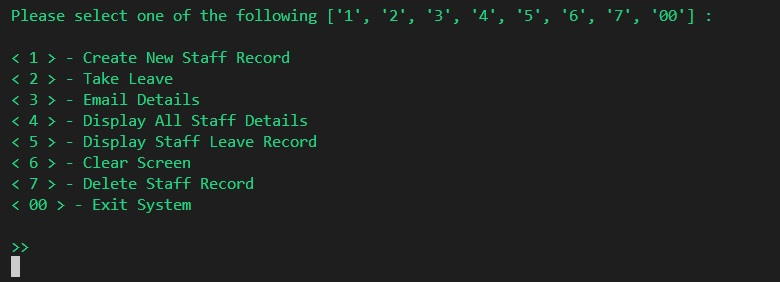
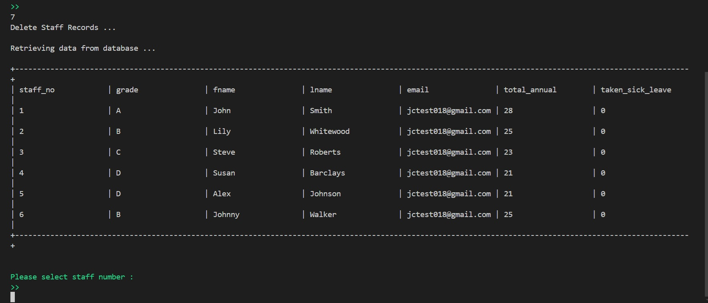

# Introduction
Leave Tracking System is a programme which automate and help the organisation to keep track of the staff annual leave and sick leave.
They system is able to create new record according to job grade, create new annual leave, email the outstanding balance to staff and is able to delete the record when the staff leave the organisation. It is a system that is linked to a google sheet which keeps track of the information. 

 [alt text](README.md)

# Features

In this section, we shows the users what to expect and what features are presented in this programme.

**Navigation options**

There are a total of 8 options which user can select from. The options are :

1. Create New Staff Record
2. Take Leave
3. Email Details
4. Display All Staff Details
5. Display Staff Leave Record
6. Clear Screen
7. Delete Staff Record
8. Exit System

**option <1> - Create New Staff Record**

Option <1> is used to create a new staff record. The programme will :
    
    - The user is aksed to input the job grade [A, B, C, D].
    - Enter First Name, Last Name and email address.
    - The system will based on user input of the job grade and assign the number of leave to the record. 
    - The system will also assign a new staff number.
    - Job Grade and the Allocated Annual Leave is found in the google sheet under the worksheet tab grade.
    - These information collected is then saved in the google sheet under the worksheet tab staff_details.

**option <2> - Take Leave**

Option <2> is used to keep track of leave taken by the staffs in the organisation. The programme will :
    
    - The programme will first display the list of staffs found in the google sheet under the worksheet tab staff_details.
    - User is to input the staff number who is going to take an annual leave. 
    - After which, the start date and end date is to be entered by the user.
    - The system will then check if there is any duplication of dates found in the google sheet under table records. 
    - The programme will then display the reason for taking the annual leave. The reasons are holidays/time off, sickness, childcare and others. These reasons are extracted from the google sheet under the worksheet tab reason.
    - Once the user has entered the reason. A new record will be created with all these information and stored in the google sheet under the worksheet tab records.
    - If user has selected, holidays/time off or sickness reasons. The system will update the worksheet tab staff_details to deduct the annual leave for holidays/ time off and to add the number of days taken for sickness reason.

   

**option <3> - Email Details**

Option <3> is to email the staff the latest total annual leave and the number of sick leave taken. The programme will :
    
    - The programme will first display the list of staffs found in the google sheet under the worksheet tab staff_details.
    - User is to input the staff number so that the system and generate an email and send to the user email address which is stored in the google sheet under the worksheet tab staff_details.

n

**option <4> - Display All Staff Details**

Option <4> is an option to display all the staff details in the organisation. The information is taken from the google sheet under the worksheet tab staff_details.

**option <5> - Display Staff Leave Record**

Option <5> is to display all the leave record of a particular staff. The programme will :

    - The programme will first display the list of staffs found in the google sheet under the worksheet tab staff_details.
    - User is to input the staff number so that the system will retrieve all the records from the google sheet under the worksheet tab records.
    - The system will then display all the leave details taken by the selected staff.

**option <6> - Clear Screen**

Option <6> is just to clear the screen.

**option <7> - Delete Staff Record**

Option <7> is to delete a slected staff record. The programme will:

    - The programme will first display the list of staffs found in the google sheet under the worksheet tab staff_details.
    - User is to input the staff number which they want to delete.
    - Once selected, the system will remove that particular staff record from the google sheet under the worksheet tab staff_details.

    

**option <00> - Exit System**

Option <00> is to end the programme.

# Database - Google Sheet

The filename of the google sheet is annual_leave.
To access this file. Please sign on with the following details :

email : jctest018@gmail.com , password: apple_test2468

There are a total of 4 tabs namely :

1. Grade
2. Reason
3. Staff_details
4. Records

**Tab 1 - Grade**

It consists of the following fields and records:

| staff_grade | num_leave | 
| ---  | --- | 
| A | 28 | 
| B | 25 |
| C | 23 |
| D | 21 |

**Tab 2 - reason**

It consists of the following fields and records:

| leave_code | reason | 
| ---  | --- | 
| 1 | holidays/ time off | 
| 2 | sickness |
| 3 | childcare |
| 4 | others |

**Tab 3 - staff_details**

It consists of the following fields and this tab is updated by user input:

- staff_no 
- grade 
- fname 
- lname  
- email 
- total_annual 
- taken_sick_leave

**Tab 4 - records**

It consists of the following fields and this tab is updated by user input:

- today_date
- staff_no 
- grade 
- fname 
- lname  
- email 
- start_date 
- end_date
- no_days_taken
- reason

# Python Features implemented in this programme.

1. Change of colour and bolding the text in the main screen.
2. Retrieving information from a tab in a google sheet.
3. Update and append new record into a google sheet.
4. Delete a record in a google sheet.
5. Updating a particular cell in a google sheet.
6. Sending an email.
7. The ability to check user input and return an error if they have entered a wrong input. ie.
    - System expecting an integer but user entered a string.
    - System expecting a string but user entered an integer.
    - System expecting a date but user entered an integer or a string.
8. Able to compare the dates in the google sheet against the user input. ie. 
    - To check if user has already taken a leave on that date.

# Testing

**Validator Testing**

- System Testing

    | Test | Tasks | What happen | Result |
    | ---  | --- | ---| ---|
    | User option selection | User to input 1,2,3,4,5,6,7 or 00 | Inputting the number | Pass|
    | User option selection | User enter wrong number or text | Enter a number or text wrongly. System display error message | Pass|
    | Create staff record (option 1) | System display list of staffs in the organisation | Input number 1 | Pass|
    | Create staff record (option 1)| System display Job Grade for user to select | Select A, B, C, D | Pass|
    | Create staff record (option 1)| System ask user for input (First Name, Last Name, Email address) | User enter details | Pass|
    | Create staff record (option 1)| System then create a record in the google sheet | System automation | Pass|
    | Take Leave (option 2)| System display list of staffs in the organisation | User enter staff number | Pass|
    | Take Leave (option 2)| User entered the wrong staff number | System display error message | Pass|
    | Take Leave (option 2)| System ask user for input (Start and end date) | User input start and end date | Pass|
    | Take Leave (option 2)| User enter wrong (Start and end date) | System display error message | Pass|
    | Take Leave (option 2)| System check for any duplication of dates taken  | System automation | Pass|
    | Take Leave (option 2)| System display a list of leave reasons | User select option | Pass|
    | Take Leave (option 2)| User enter the wrong reason | System display error message | Pass|
    | Take Leave (option 2)| System then create a record in the google sheet | System automation | Pass|
    | Email Details (option 3)| System display list of staffs in the organisation | User enter staff number | Pass|
    | Email Details (option 3)| User entered the wrong staff number | System display error message | Pass|
    | Email Details (option 3)| Email send automatically | System automation | Pass|
    | Display All Staff Details (option 4)| System display list of staffs in the organisation | User enter staff number | Pass|
    | Display All Staff Details (option 4)| User entered the wrong staff number | System display error message | Pass|
    | Display All Staff Details (option 4)| System retrieve from google sheet and display as list | System automation | Pass|
    | Display Staff Details (option 5)| System display list of staffs in the organisation | User enter staff number | Pass|
    | Display Staff Details (option 5)| User entered the wrong staff number | System display error message | Pass|
    | Display Staff Details (option 5)| Syste, display the selected staff records from google sheet | System automation | Pass|
    | Clear Screen (option 6)| System clear the screen | System automation | Pass|
    | Delete Staff Record (option 7)| System display list of staffs in the organisation | User enter staff number | Pass|
    | Delete Staff Record (option 7)| User entered the wrong staff number | System display error message | Pass|
    | Delete Staff Record (option 7)| System delete the record which user has selected | System automation | Pass|

# Deployment

The site was deployed to GitHub and Heroku pages. The steps to deploy are as follows:

The live link can be found here - https://leavetrackeruk-7e349952c4d1.herokuapp.com/

# Credits

**Content**

- Understanding the source codes from Love Sandwiches to build my own programme.

- To display the data in a [table format](https://github.com/SuperMaZingCoder/TableIt).

- To calculate the [no of days](https://www.w3resource.com/python-exercises/python-basic-exercise-14.php) when user enter the start and end dates.

- To be able to [delete a row](https://stackoverflow.com/questions/14625617/how-to-delete-remove-row-from-the-google-spreadsheet-using-gspread-lib-in-pytho#:~:text=Since%20gspread%20version%200.5.,a%20row%20with%20delete_row()%20).

- How to update a [particular cell](https://readthedocs.org/projects/gspread/downloads/pdf/latest/#:~:text=Here%20are%20the%20methods%20that,the%20cells%20of%20the%20sheet.&text=get()%20fetches%20all%20values%20from%20a%20range%20of%20cells.&text=batch_get()%20can%20fetch%20values,cells%20with%20one%20API%20call.&text=update()%20lets%20you%20update,with%20a%20list%20of%20lists) in the google sheet.

- How to send [email](https://medium.com/@ak942389/sending-email-with-python-using-smtp-4cd210e8de95). 
- [W3school](https://www.w3schools.com) - For guiding me how to write the codes.

- Instruction to deploy is taken from [Github]().
